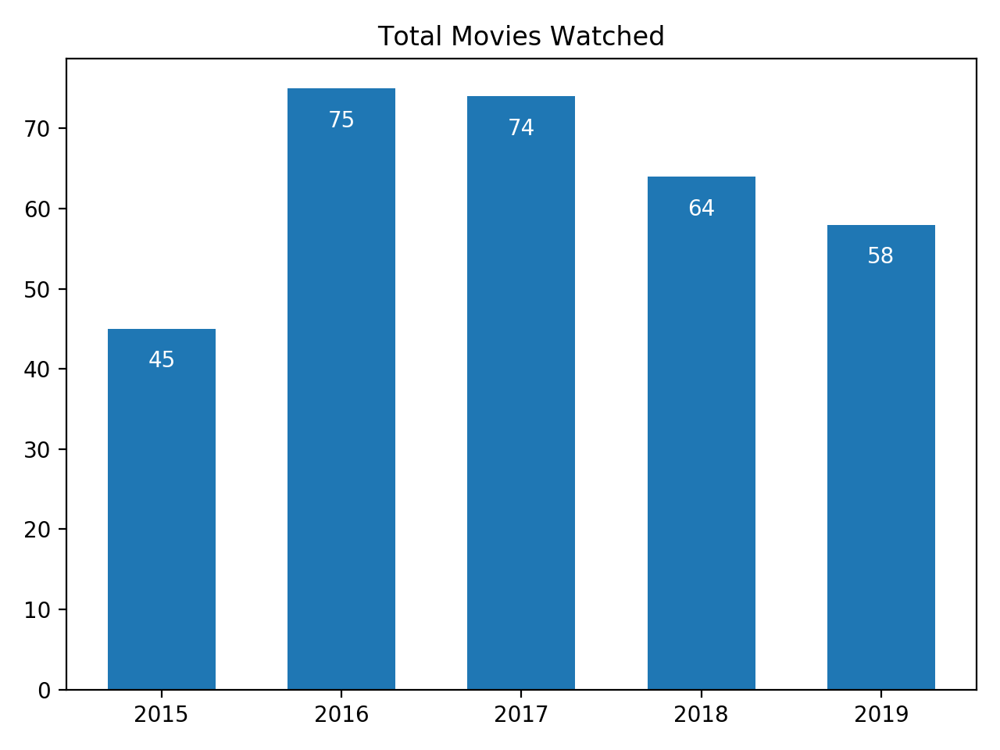
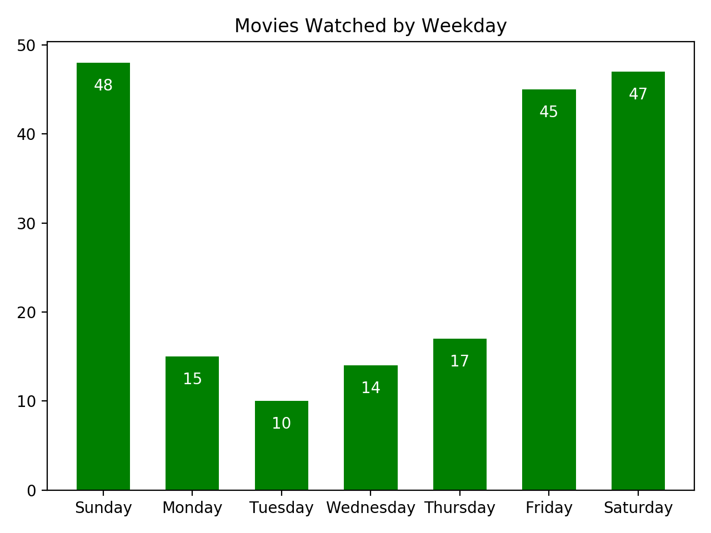
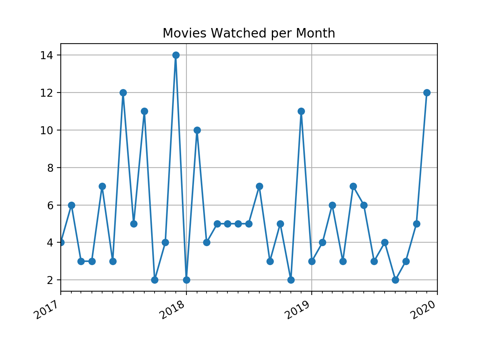
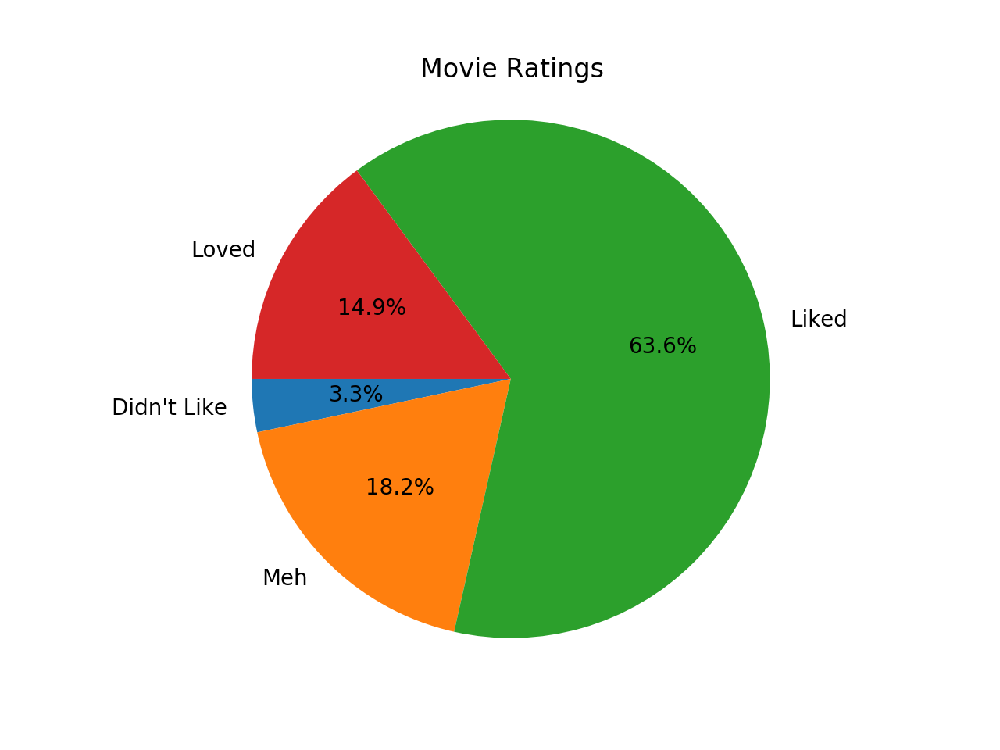

Back in 2015, I started to keep a list of every movie I watched. For some reason I thought it would be fun to look back each year and see what movies I’d watched. After stockpiling 5 years of lists on my phone, I decided to finally do something with all my movie watching data.

For visualizing my data, I used Python and [matplotlib](https://matplotlib.org/). I loaded my data into my Python program from text files copied from my phone. After putting all the data into a custom data structure, I manipulated the data to create visualizations.

A quick summation of the data showed that I watched 316 movies from 2015 through 2019. My first plot shows the breakdown of how many movies I watched per year.

2015 was my last full year of college, so it makes sense that I watched the least amount of movies that year. I was probably too busy procrastinating on homework.

As the years went by, I began to keep track of more data points in my lists. Starting in 2017, I began recording not only the title of the movie, but the date I watched the movie as well. With this additional date data, I could create more interesting time based visualizations. For example, I created a chart showing how many movies I watched per day of the week.

Honestly this chart isn’t surprising. Now I finally have some data to prove that I work Monday through Friday.

Next I looked at how many movies I watched per month.

At first glance this graph looks mostly random. But upon closer inspection, you can see large spikes in December of every year, with the highest spike reaching 14 movies in 2017. I think the moral of the story is that I watch a lot of movies during the holiday season.

Another quick note: there’s a relative jump in February 2018 where my monthly total reached 10 movies. This is the third highest month not counting Decembers. It also happens to be the same month I started using the movie subscription service [MoviePass](https://en.wikipedia.org/wiki/MoviePass). Rest in peace, MoviePass.

As for the two other spikes in 2017, I don’t really have an explanation other than me just being very unproductive.

In 2018, I added one more data point to my list: a rating. My rating system is very simple and completely subjective. I’m not trying to be Roger Ebert here. I’m essentially keeping track of how I feel about a movie. I rate movies on a 1 to 5 scale, 5 being the highest.

1. hated the movie
2. didn’t like the movie
3. didn’t have a strong opinion of the movie
4. liked the movie
5. loved the movie

Visualizing 2018 and 2019’s ratings looks something like this:

Again, my ratings aren’t a measure of a film’s artistic merit. It’s basically a measure of my enjoyment of a movie. I liked or loved upwards of 78% of the movies I watched. I also didn’t hate any of the movies I watched. It seems like nowadays we can largely avoid awful movies thanks to online reviews.

You can check out the source code for this project [here](https://github.com/schlomest/movie-watching-visualization).

