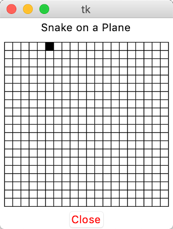
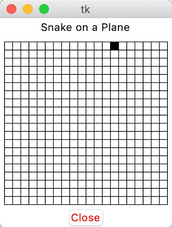
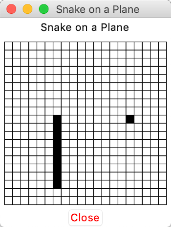

In honor of Samuel L. Jackson’s 2006 movie [*Snakes on a Plane*](https://www.imdb.com/title/tt0417148/), I decided to build the game Snake while on a plane using Python. Since long flights and delayed departures can lock people into one seat for an uncomfortable amount of time, I thought building a software project would be a great way to pass the time on my most recent vacation.

In order to make this project a challenge, I gave myself a few restrictions before I began.

__1. I can’t use the internet__

That means no Google and no Stack Overflow. The entire game of Snake must come from my own head.

__2. I can’t use third party libraries__

Sticking to the core Python library seemed like a fun way to learn more about Python. I downloaded the Python documentation before my flight to work around the no internet rule.

__3. I must complete the game by the end of my last flight__

My entire trip consisted of five flights, which seemed like more than enough time to create a game. I limited myself to coding only on flights and in airports.

---

Going into this project, I knew that Python came with a GUI library out of the box. I hadn’t yet used the library, but this fact alone gave me enough assurance that I could actually build a game without any additional libraries.

Once I was in the air on my first flight, I pulled up the Python docs and scrolled to the [GUI library](https://docs.python.org/3/library/tk.html). Python’s GUI package is actually just a wrapper for a preexisting graphical user interface library called [Tk](https://www.tcl.tk/). Tk and its underlying language, Tcl, together make up Python’s GUI technology. If you know Tk/Tcl then you know how to create GUIs with Python. I had never used Tk/Tcl, so I became a little worried once I read this in the docs:

>The tkinter package is a thin object-oriented layer on top of Tcl/Tk. To use tkinter, you don’t need to write Tcl code, but you will need to consult the Tk documentation, and occasionally the Tcl documentation.

I hadn’t packed my Tk documentation and I already committed to abstaining from the internet, so I was forced to improvise. Python’s tkinter documentation gave me enough information to start coding, but I was also able to learn more about Tk’s GUI widgets through Python’s source code. By the end of [my first flight](https://bitbucket.org/schlomer/snake-on-a-plane/commits/2e8c62b9e3f6b77266cbd4a4c5e64fcf9a438aa0) I had a static game board built.

```python
board = tkinter.Canvas(frame, width=BOARD_SIZE*1.2, height=BOARD_SIZE*1.2)
board.create_rectangle(x0, y0, x0 + BOARD_SIZE, y0 + BOARD_SIZE)

# draw grid
for i in range(0, BOARD_SIZE, SQUARE_SIZE):
    board.create_line(x0 + i, y0, x0 + i, y0 + BOARD_SIZE)
    board.create_line(x0, y0 + i, x0 + BOARD_SIZE, y0 + i)

board.pack(fill=BOTH, expand=1)
```

To create the board, I drew an outer rectangle, followed by horizontal and vertical lines for the grid.

<div class="image-container">
    
</div>

Drawing a static game board wasn’t difficult. The more complicated next step was to get a square moving on the board based on user input. Small incremental successes are better than getting lost in a large failure, so instead of trying to make the whole snake move, I tried at first to make only one square move.

After refactoring the existing code into a `SnakeApp` class, I found a way to accept keystroke inputs from the user.

```python
# bind controls
self.master.bind("<Left>", self.turn_left)
self.master.bind("<a>", self.turn_left)
self.master.bind("<Right>", self.turn_right)
self.master.bind("<d>", self.turn_right)
self.master.bind("<Up>", self.turn_up)
self.master.bind("<w>", self.turn_up)
self.master.bind("<Down>", self.turn_down)
self.master.bind("<s>", self.turn_down)
```

I bound the standard game movement keys (arrow keys and WASD) to corresponding movement methods. Each movement method moved the current position of the square on the board. Thankfully a delayed flight gave me enough time to implement the left and right movement methods. By the time I landed in New York I had the up and down movement methods working as well.


<div class="image-container">
    
    
</div>

To simulate the snake’s movement, I needed to update the snake’s position over time. In order to continually update the snake’s position over time, I opened a new thread after initializing the GUI widgets.

```python
# start snake thread for movement
self.active = True
self.direction = "RIGHT"
self.snake_thread = Thread(target=self.move_snake)
self.snake_thread.start()
```

This thread is dedicated to the snake’s movement. As long as the game is active, the snake will move in whatever direction is currently set. The position of the snake is updated every half second.

```python
def move_snake(self):
    while self.active:
        if self.direction == "LEFT":
            self.move_left()
        elif self.direction == "RIGHT":
            self.move_right()
        elif self.direction == "UP":
            self.move_up()
        elif self.direction == "DOWN":
            self.move_down()

        sleep(.5)
```

Visually the game was starting to come together at this point, though I still needed game logic for eating and collisions. The game should end when the snake crashes into itself, but before I could check for collisions, I needed a data structure for storing the snake in memory.

I originally thought that a linked list would be the best method for storing the snake. Each node of the linked list could store the position of a snake segment along with a reference to the next snake segment. But after mulling over data structures while on the beach, I decided to use a simple list instead.

```python
 class Snake():
    def __init__(self, snake_board):
        ...
        self.body = [[5, 5], [4, 5], [3, 5]]
        self.body_ui = [snake_board.fill_square(self.body[0][0], self.body[0][1]),
                        snake_board.fill_square(self.body[1][0], self.body[1][1]),
                        snake_board.fill_square(self.body[2][0], self.body[2][1])]
```

The `Snake` class has two lists for storing the snake’s position: one for storing the position of each square on the board and the other for storing the ID of that square.

When I call tkinter’s `create_polygon` method to fill in the individual squares, the method returns an ID that can later be used for deleting the square. I stored these IDs in the `body_ui` list.

The `body` variable contains the snake’s coordinates on the grid. It’s initialized with the starting position of the snake.

These two lists are tightly coupled. Every time the snake updates, it needs to update both lists. For that reason, it might be worth combining them into one structure. Or maybe that level of atomicity isn’t worth the extra effort.

The good thing about using lists is that the updates are relatively straightforward. To move the snake over one space, add a new element to the front of the list and pop off the last element. To make the snake grow, add a new front element without popping off the back element. Halfway through my last flight, I wrote this functionality and I had a fully functional game of snake.

There are a few bugs in my code. The movement thread doesn’t close properly if you click the x button instead of the close button. I could’ve spent my remaining time polishing the code. I chose to play some snake instead.

<div class="image-container">
    
</div>

To view the final code or to run it yourself, check it out [here](https://github.com/schlomest/snake-on-a-plane).
